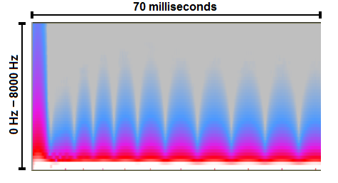
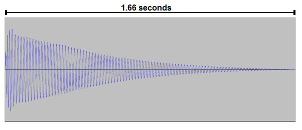
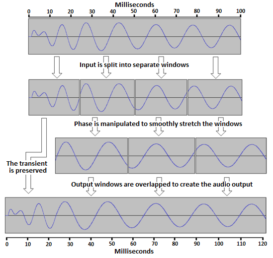
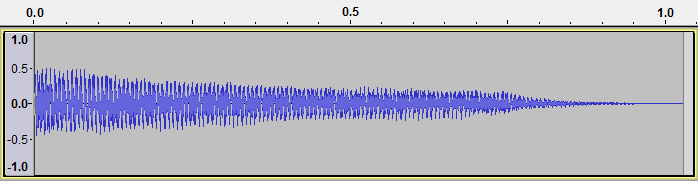

How the PhaseVocoder Works
==========================

The PhaseVocoder allows for time expansion/compression and pitch shifting of audio.  The general process involves analyzing input audio and placing it into two different categories: transient components and sinusoidal components.  An audio transient is usually a higher amplitude, short-duration percusive sound occurring at the onset of audio such as a drum hit or musical note (more info on transient detection [here](TransientDetection.md)).  Frequently, audio with more sinusoidal components follows the transient.  The PhaseVocoder works by preserving the transient and stretching or compressing the phase of the sinusoidal components of the input audio.

 

**Time Expansion Example**

The waveform and spectrogram below is that of the first 70 milliseconds of a bass drum.  A wave file of this audio can be found [here](https://github.com/tmdarwen/PhaseVocoder/blob/master/Source/Signal/UT/TestAudio/808BassDrum.wav).  In the waveform, note how the first few milliseconds of audio has an irregular shape and then the waveform follows a sinusoidal shape.

  

Similarly, in the spectrogram below, note how the first few milliseconds of audio has strong amounts of energy across nearly the entire spectrum of 0 to 8,000 Hz before concentrating at specific lower frequencies.

  

The entire waveform of the bass drum can be seen below.  After the initial transient, the audio continues uninterrupted for the entire 1.66 seconds.  In other words, no other transients occur aside from the initial transient.

  

In order to apply time expansion or compression to the input audio, without degrading audio quality, the PhaseVocoder first preserves the transient section.  The PhaseVocoder then takes small windows of the audio following the transient, adjusts the phase of the window in the frequency domain, before taking the inverse Fourier transform and writing the window to the output audio.  The following is an oversimplification but should give you a general idea of how the process works:

  

 

**Pitch Shifting**

Shifting the pitch of audio without changing its length is done using a resampler in conjunction with the phase vocoding technique described above.

The key to understanding pitch shifting is to understand that playing audio back at different sample rates adjusts the pitch of the audio.  For example, if you have audio of a C2 piano note (65.41 Hz) recorded at 44.1 KHz, playing back the audio at twice the sample rate (88.2 KHz) will result in a C3 piano note (130.81 Hz), effectively adjusting the pitch up by an octave.  

Similarly, playing back the audio at half the sample rate (22.05 KHz) will result in a C1 piano note (32.70 Hz).  These examples are shown below.  Take note of the values above the waveform on the x-axis.  These are in units of seconds.

A C2 piano note recorded at 44.1 KHz two seconds in durations:

  

The C2 piano note recorded at 44.1 KHz but played back at 88.2 KHz results in a pitch shift up by one octave to C3.  Note the duration of the audio is cut in half to one second:

  

The C2 piano note recorded at 44.1 KHz but played back at 22.05 KHz results in a pitch shift down one octave to C1.  Note the duration of the audio is doubled to four seconds:

  

As shown above, pitch shifting can be accomplished by adjusting sample rates.  However, this results in the length of the input audio being extended or reduced.  This is where the PhaseVocoder's phase vocoding abilities come in.  Often in audio editing and production you'll want the note to remain a constant time length as the pitch is adjusted.  The same phase vocoding technique explained earlier in this document is applied to the resampled audio to accomplish this.
