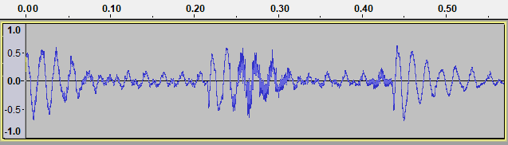
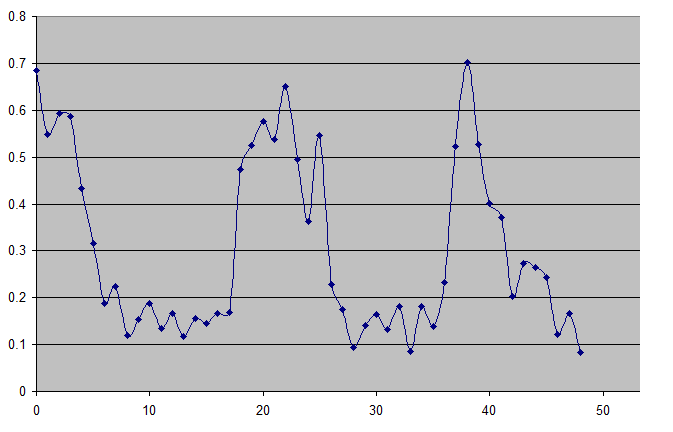
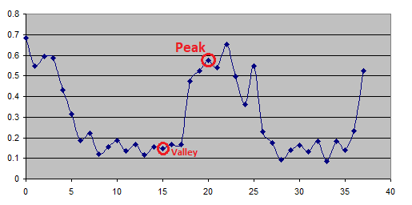
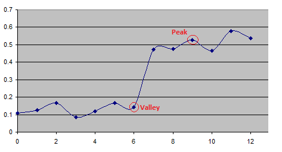
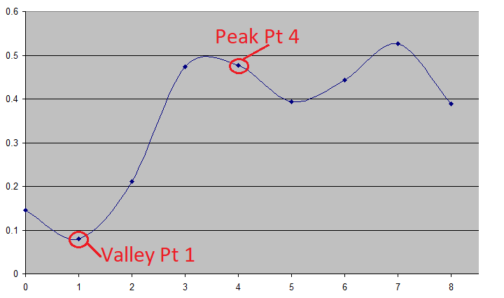
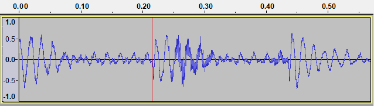
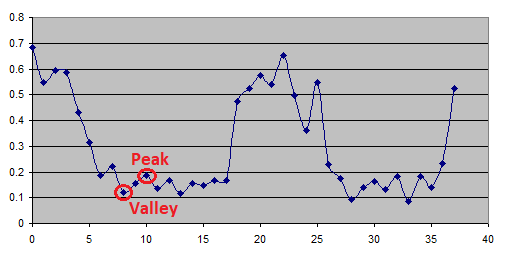

Transient Detection
===================

A transient is usually a higher amplitude, short-duration percusive sound occurring at the onset of audio such as a drum hit or musical note.  For the sake of sound quality, it's key to preserve transients when performing the phase vocoding process.

What qualifies audio as being a transient is debatable, and therefore can be difficult to auto-detect.  What I explain below is a transient detection algorithm I've developed.  One important item to note about this algorithm is that it's imperative to make the transient detection point occur _immediately before_ the transient begins.  If the PhaseVocoder does not preserve the entire transient the audio quality will suffer.

 

**Transient Detection By Example**

In the audio snippet pictured, it's clear we have three transients: One at the very beginning of the audio, one between 0.20 and 0.30 and another one between 0.40 and 0.50.

  

When first analyzing audio input, detecting the first transient is a special case.  We simply consider the first audio that occurs above a nominal audio output threshold to be the transient.  Because of this, it's more useful here to explain how the second transient (between 0.20 and 0.30) is detected.

The first step we perform in transient detection is to reduce the input signal down to roughly twelve millisecond sections, plotting a point that is the max sample value in this twelve millisecond section as shown below.

  

We then take note of the "peak" and "valley" points in this graph as shown below.

  

We then perform the exact same process between the valley and peak sample positions but at a resolution of about six milliseconds, resulting in the following:

  

And then one additional time at a resolution of about one millisecond:

  

We use this final valley point to calculate the beginning of the transient.  For this example, this results in finding the transient position _immediately before_ the transient occurs as shown below.

  

Another way of considering this process is that we're recursively "zooming in" on the point where the audio transitions from low intensity to high intensity to pinpoint the start of the audio transient.

 

**Transient Qualification**

Of course, not every peak/valley combination is a transient.  In order for a peak/valley combination to be considered a transient the peak value must be at least 1.5 times greater than the valley.  Note the image below.  The circled peak and valley combination is not considered a transient since the growth from the valley point to the peak point is less than a ratio of 1.5.

  

When using the PhaseVocoder, this ratio can be configured by the user through the `--valleypeakratio`.  This option allows the user to set a specific ratio.  The default ratio is 1.5.  Setting a lower ratio will result in the software more liberally detecting audio transients, setting a higher ratio will cause the software to be more strict when considering if a peak/value combination is a transient.
